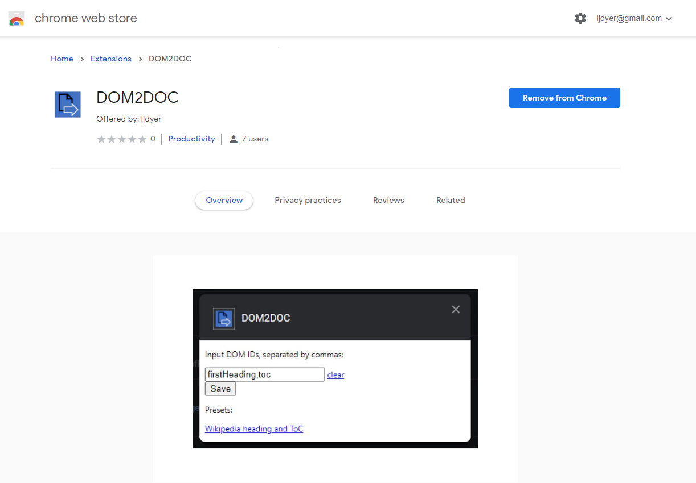
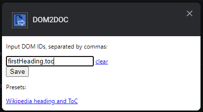

# dom2doc

dom2doc is a browser extension for Google Chrome and Mozilla Firefox that lets you download text from the DOM elements that you specify as a Word file.

It was developed for and is currently used by a team of translators whose daily work includes extracting text from specific parts of pages on certain browser-based systems.

## How to use

1. Go to the extension page on the [Chrome Web Store](https://chrome.google.com/webstore/detail/dom2doc/bfgjdnmanmdaklalneoehioaklbdgaej?hl=en-GB) or [Firefox Browser Add-ons site](https://addons.mozilla.org/en-GB/firefox/addon/dom2doc/).

2. Follow the instructions to add the extension to your browser.
3. In the extension options, enter the IDs of the webpage elements you want to get text from and click **Save**.

If you are not sure how to find out the IDs of webpage elements, read [this](https://support.demandbase.com/hc/en-us/articles/360024998432-How-do-I-find-an-HTML-ID-or-name-).

4. Navigate to the page you want to get text from and click the extension icon in the top right of the browser window.

5. Open up the Microsoft Word document that was saved to your downloads folder.
